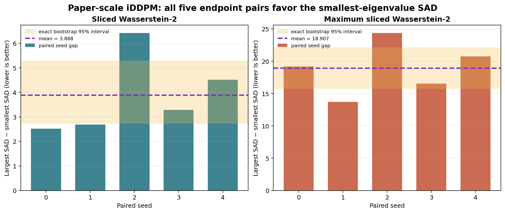
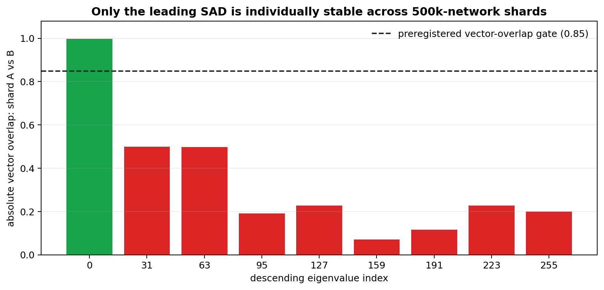
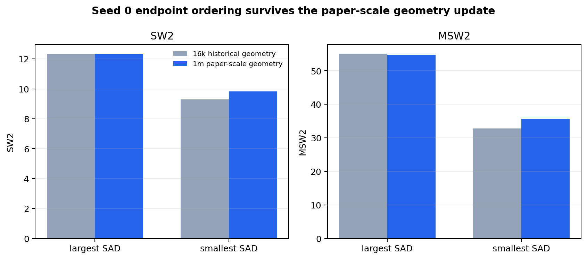

# Anisotropy reproduction — endpoint evidence and geometry stability



**Date:** 2026-07-27 · **Project:** `icml26-repro-pRgUJfrFw9-on-the-anisotropy-of-score-based-generative-models` · **Live judged score:** 5/12

The strongest completed generation result is a five-seed exact-iDDPM endpoint
comparison using the paper-scale one-million-network geometry. Every paired
seed has higher SW2 and MSW2 at the largest-eigenvalue SAD than at the
smallest. The mean largest-minus-smallest differences are `+3.887630` SW2 and
`+18.907079` MSW2; exact exhaustive paired-bootstrap 95% intervals are
`[2.742088, 5.279937]` and `[15.828264, 22.082122]`.

This directly replaces the earlier formula proxy with faithful generation
evidence, but it is deliberately not called full verification. Only the
leading individual eigenvector was stable across two independent
500,000-network geometry shards. The bottom and all seven audited interior
directions were not individually stable, so an exact multi-direction rank
test is blocked rather than silently run on arbitrary estimator rotations.

## Central question

The paper asks whether an untrained score network's architecture creates
preferred output directions, encoded by eigenvectors of its average geometry
matrix. Figure 6 reports that an iDDPM models rank-one Gaussian data better
when the data direction aligns with small-eigenvalue SADs and worse when it
aligns with large-eigenvalue SADs.

The reproduction implements the author D=256 iDDPM U-Net and exact Figure 6
quantities: 10,000 rank-one training samples, 2,000 optimizer updates, 1,000
reverse-diffusion steps, 10,000 generated samples, and 16,384 normalized
Gaussian projections for SW2/MSW2. Every endpoint run has deterministic,
separate seeds for initialization, data, shuffling, DSM noise, sampling,
metric targets, and projections.

## Paper-scale five-pair endpoint round

| Seed | Largest SW2 | Smallest SW2 | Difference | Largest MSW2 | Smallest MSW2 | Difference |
| ---: | ---: | ---: | ---: | ---: | ---: | ---: |
| 0 | 12.341827 | 9.818525 | +2.523301 | 54.839661 | 35.656101 | +19.183560 |
| 1 | 11.568896 | 8.878388 | +2.690507 | 43.442307 | 29.750766 | +13.691540 |
| 2 | 11.349946 | 4.925080 | +6.424866 | 43.400477 | 19.025318 | +24.375159 |
| 3 | 11.619387 | 8.336563 | +3.282824 | 44.984068 | 28.456957 | +16.527111 |
| 4 | 10.211508 | 5.694858 | +4.516651 | 42.128257 | 21.370234 | +20.758023 |
| **Mean** |  |  | **+3.887630** |  |  | **+18.907079** |

The formal aggregate enumerated all `5^5 = 3,125` paired bootstrap resamples.
All ten endpoint exact-setup and independent-checker flags passed. Reversing
the endpoint labels produced negative mean effects and failed the positive
effect rule, as required. The accepted aggregate is run
`0c6c3210-941e-443c-ab16-dd524c804ac9` at commit `26b31ae`.

**Assessment:** paper-scale endpoint corroboration. It directly tests the two
extreme directions, but it does not establish monotonic ordering over
intermediate SAD ranks.

## Paper-scale geometry audit



Two independent HF CPU runs generated disjoint 500,000-network geometry
shards using the author architecture and probe. Their equal-weight aggregate
is exactly one million networks. The independent reconstruction recovered
`lambda_max = 134.914166` and `lambda_min = 0.094335`, with zero selected
eigenvalue disagreement, PSD and orthonormality checks passing, and a rejected
random-direction control.

The preregistered individual-direction gate required absolute cross-shard
vector overlap at least `0.85` and local-band mean cosine at least `0.75`.
Only descending index 0 passed. The bottom index 255 had vector overlap
`0.199398`, even though its local band was much more stable. This indicates a
stable low-eigenvalue subspace but not a uniquely identified bottom vector.

**Assessment:** paper-scale geometry construction complete. Exact eigenvalue
rank should not be causally assigned to an unstable individual direction.

## Historical comparison and correction



| Geometry | Endpoint | Eigenvalue | Cross-shard overlap | SW2 | MSW2 |
| --- | --- | ---: | ---: | ---: | ---: |
| 16k historical | largest | 133.589864 | not paper-scale | 12.332753 | 55.056512 |
| 16k historical | smallest | 0.095078 | not paper-scale | 9.292187 | 32.753373 |
| 1m paper-scale | largest | 134.914166 | 0.997695 | 12.341827 | 54.839661 |
| 1m paper-scale | smallest | 0.094335 | 0.199398 | 9.818525 | 35.656101 |

The seed-zero result changed modestly after replacing the 16,000-network
estimate with the paper-scale estimator, but the ordering did not. The
corrected largest-minus-smallest gaps are `+2.523301` SW2 and `+19.183560`
MSW2. All ten paper-scale endpoint runs passed geometry reconstruction, exact
setup, independent metric recomputation, negative control, and cumulative
Claims 2/3/6 regressions.

**Assessment:** the historical evidence is preserved but superseded. The
smallest full-estimator direction reproduces the literal paper procedure but
is not stability-certified.

## Implementation path

The fixed command is identical across every experiment:

```text
uv sync --locked && .venv/bin/python repro/run_campaign.py
```

The geometry verifier runs before generation. It reconstructs the full
one-million matrix from hash-checked shard inputs, solves the eigensystem, and
writes the selected direction and stability audit. The endpoint verifier then
constructs the author `Diffuser`, trains on `N(0, 256 vv^T)`, generates through
all 1,000 reverse steps, retains all 16,384 projection-level squared
Wasserstein values, and invokes an independent NumPy checker.

No generation result selects a direction, seed, horizon, projection count, or
tolerance. The seed blocks and direction indices are committed before launch.
A wall-time-only throughput gate at optimizer step 10 rejects slow hosts
without inspecting losses or scientific outcomes.

## Experiment lineage and reproducibility

| Experiment | Branch | Run | Commit | Outcome | Compute |
| --- | --- | --- | --- | --- | --- |
| Geometry shard A | `orx/claims-1-and-4-one-million-geometry-shard-a` | `9027461d-3dae-46b2-b88d-cef5ed0592a0` | `546bff1` | 500k checks pass | HF cpu-upgrade, 32 physical CPUs, 30m25s |
| Geometry shard B | `orx/claims-1-and-4-one-million-geometry-shard-b` | `d7ea7073-d087-4dc1-9268-969c08b31123` | `b6d4445` | 500k checks pass | HF cpu-upgrade, 32 physical CPUs, 30m16s |
| One-million aggregate | `orx/claims-1-and-4-one-million-geometry-aggregate` | `3d7901fe-d3e0-4f41-b8a8-ebd077bc5da5` | `b939c5b` | only index 0 stable | HF cpu-upgrade, 32 physical CPUs, 1m51s |
| Historical five-pair aggregate | `orx/claims-1-and-4-five-pair-endpoint-aggregate` | `9351e9e2-8fee-421b-bd98-2dc7d1b3a389` | `4aed2d9` | superseded downscaled corroboration | HF cpu-upgrade, 32 physical CPUs, 53s |
| Paper-scale endpoint seeds 0–4 | ten `orx/claim-1-and-4-one-million-*` branches | ten terminal runs frozen in the aggregate | commits `704eb01`–`e39a7fc` | every paired gap positive | HF cpu-upgrade, torch 4 threads, 2h27m–4h13m each |
| Paper-scale five-pair aggregate | `orx/claims-1-and-4-one-million-five-pair-aggregate` | `0c6c3210-941e-443c-ab16-dd524c804ac9` | `26b31ae` | exact paired intervals exclude zero | HF cpu-upgrade, 32 physical CPUs, 42s |

## Claim status and next work

| Claim | Current research status | Why it is not promoted further |
| --- | --- | --- |
| 1 — SAD definition and generation preference | BLOCKED | Paper-scale endpoint evidence is complete, but two endpoints cannot establish the conjectured full ordering and every audited non-leading direction is unstable. |
| 2 — linear DSM anisotropic convergence | VERIFIED | Exact training dynamics, GD/SGD comparison, independent gradient derivation, and negative control pass. |
| 3 — alignment extrema theorem | VERIFIED | Exhaustive finite-domain extremum plus independently reconstructed derivation and control pass. |
| 4 — iDDPM performance versus SAD eigenvalue | BLOCKED | All five endpoint pairs align, but monotonicity over intermediate ranks is not tested because those individual SAD directions fail stability. |
| 5 — MNIST/CelebA-HQ/CIFAR-10 alignment intervention | BLOCKED | Four distinct routes found no available faithful training artifacts or feasible CPU-only full-data experiment. |
| 6 — architecture-specific geometry | VERIFIED | Architecture-derived MLP/CNN/Transformer checks and controls pass. |

The predeclared nine-direction node remains unrun: its prerequisite stability
gate found no defensible interior individual directions. Publication remains
blocked until the evaluator-visible artifact and all release gates pass. The
live judged score remains 5/12; no score increase is claimed before a new live
judge revision.

## Historical failures and controls

- Early HF hosts were rejected solely by the preregistered wall-time gate;
  they produced no scientific endpoint evidence.
- One seed-4 launch used a default image without `uv` and exited before
  scientific code ran; the unchanged commit was relaunched in the official
  `uv` image.
- A local one-million aggregate run passed numerically but was rejected as
  release evidence because cumulative library thread counts were uncertain;
  the unchanged commit was rerun and accepted on HF cpu-upgrade.
- Reversed endpoint labels fail the five-pair positive-effect rule.
- Random geometry directions fail the eigensystem residual/structure checks.
- Two aggregate launches used images without `uv` and exited 127 before any
  verifier ran; the unchanged commit passed on the project-standard official
  `uv` image.
